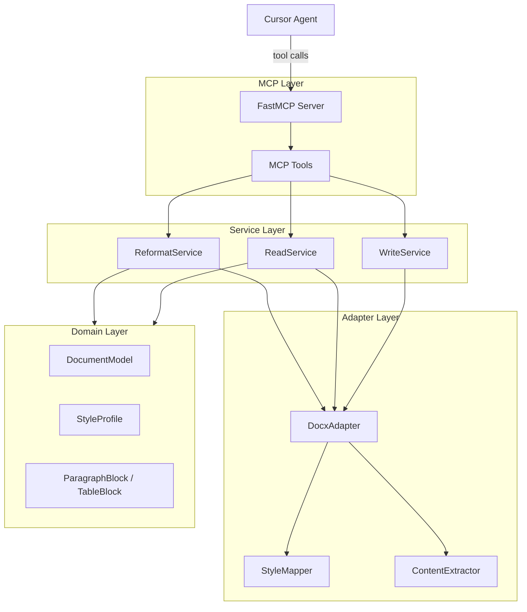

# docs-mcp — Agent Guidelines

## Architecture

Layered design: MCP tools delegate to services, services use adapters, adapters translate to/from domain models.



## Layer dependency rules

| Layer | Package | May import from | Must not import |
|---|---|---|---|
| MCP | `server.py` | `services/`, `errors` | `adapters/`, `docx` |
| Service | `services/` | `adapters/`, `domain/`, `errors` | `docx`, `mcp` |
| Adapter | `adapters/` | `domain/`, `errors`, `docx` | `services/`, `mcp` |
| Domain | `domain/` | stdlib only | everything else |

**Dependency direction is always downward:** MCP → Service → Adapter → Domain.

## Cross-cutting rules

- **New MCP tool** = thin handler in `server.py` + service method. No business logic in `server.py`.
- **`python-docx` imports only in `adapters/`** — never in services or MCP layer.
- **Structured errors** — return `{ "code", "message", "details" }` via `DocxMcpError.to_dict()`. Do not throw raw strings to MCP clients.
- **Domain models are the stable contract** between services and adapters. Services work with domain types, not python-docx objects.
- **Dependency injection** — services receive `DocxAdapter` via constructor, not module-level singletons.

## Project layout

```
docs-mcp/
├── README.md
├── pyproject.toml
├── AGENTS.md
├── plans/
├── src/docx_mcp/
│   ├── server.py
│   ├── errors.py
│   ├── domain/
│   ├── adapters/
│   └── services/
├── tests/
│   └── fixtures/
└── examples/
```

## Subplan workflow

Implement one subplan at a time (`plans/SP-XX-*.md`). Read the active subplan before making changes. Do not implement features from later subplans.

## Development

```bash
uv sync --extra dev
uv run pytest
```
