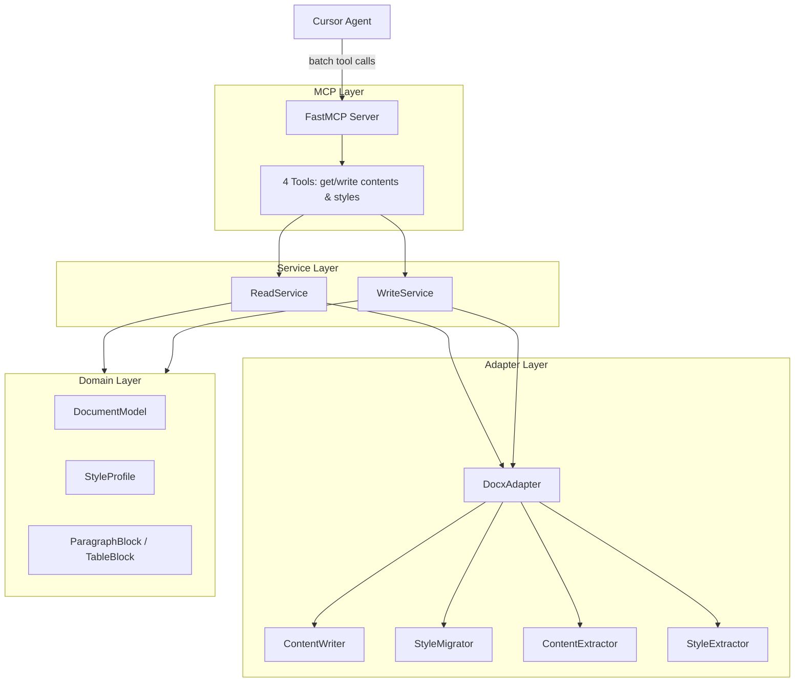

# docs-mcp

MCP server for reading and writing `.docx` files. Exposes four paginated tools so agents can batch-read document content and styles, write content, and union style definitions — without a monolithic reformat tool.

**Requirements:** Python 3.11+

## Features

| Tool | Purpose |
|---|---|
| `get_contents_from_docx` | Batch-read content blocks (paragraphs and tables) |
| `write_contents_to_docx` | Write content blocks; creates file if missing |
| `get_styles_from_docx` | Batch-read paragraph style catalog |
| `write_styles_to_docx` | Union style definitions onto an existing file (incoming wins on conflict) |

Primary use case: **reformat a draft document using a template's styles** — the agent orchestrates four tool calls with pagination.

## Architecture

Layered design: MCP tools delegate to services, services use adapters, adapters translate to/from domain models.



### Layer rules

| Layer | Package | May import from | Must not import |
|---|---|---|---|
| MCP | `server.py` | `services/`, `errors` | `adapters/`, `docx` |
| Service | `services/` | `adapters/`, `domain/`, `errors` | `docx`, `mcp` |
| Adapter | `adapters/` | `domain/`, `errors`, `docx` | `services/`, `mcp` |
| Domain | `domain/` | stdlib only | everything else |

Dependency direction is always downward: **MCP → Service → Adapter → Domain**.

See [AGENTS.md](AGENTS.md) for contributor guidelines.

## Tech stack

- [python-docx](https://python-docx.readthedocs.io/) — `.docx` I/O
- [MCP Python SDK](https://github.com/modelcontextprotocol/python-sdk) (`mcp>=1.12.0`) — FastMCP server
- [uv](https://docs.astral.sh/uv/) — package manager and runner

## Quick start

### 1. Clone and install

```bash
git clone <repo-url> docs-mcp
cd docs-mcp
uv sync --extra dev
```

### 2. Run tests

```bash
uv run pytest
```

### 3. Smoke test the MCP server

```bash
uv run docx-mcp
```

The process listens on stdio (JSON-RPC). Press Ctrl+C to stop.

### 4. Add to Cursor

Replace `/absolute/path/to/docs-mcp` with your clone path. Cursor MCP config requires **absolute paths**.

**Native (uv):**

```json
{
  "mcpServers": {
    "docs-mcp": {
      "command": "uv",
      "args": [
        "run",
        "--directory",
        "/absolute/path/to/docs-mcp",
        "docx-mcp"
      ]
    }
  }
}
```

**Docker (ephemeral session):**

Build once from the repo root (no file paths in the image or build command):

```bash
cd docs-mcp
docker build -t docs-mcp .
```

MCP config — only how to start the server process. **Which files to read/write is not configured here**; every tool receives `file_path` from the MCP client (agent/user) at call time:

```json
{
  "mcpServers": {
    "docs-mcp": {
      "command": "docker",
      "args": ["run", "--rm", "-i", "docs-mcp"]
    }
  }
}
```

**File paths in tool calls**

| Runtime | `file_path` in tools |
|---|---|
| Native (`uv`) | Host path as passed by the agent, e.g. `/home/user/docs/report.docx` |
| Docker | Path inside the container filesystem |

With Docker, the default config above has no bind mounts — tool paths must exist inside the container unless you extend `args`. To read/write host files, add a volume mount that matches the paths you pass in tools, for example:

```json
"args": ["run", "--rm", "-i", "-v", "/home/user/docs:/home/user/docs", "docs-mcp"]
```

Then the agent calls `get_contents_from_docx(file_path="/home/user/docs/report.docx")` — same path string on host and in the container.

> One container runs for the entire MCP session (not per tool call). The host spawns the process on connect and tears it down on disconnect; `--rm` removes the container automatically.

## Tools reference

All tools return JSON-serializable dicts. On failure, the response contains structured error fields instead of raising an unhandled exception:

```json
{
  "code": "FILE_NOT_FOUND",
  "message": "File not found: /path/missing.docx",
  "details": { "path": "/path/missing.docx" }
}
```

Error codes: `FILE_NOT_FOUND`, `FILE_NOT_READABLE`, `FILE_NOT_WRITABLE`, `INVALID_PATH`, `PARSE_ERROR`, `STYLE_NOT_FOUND`, `REFORMAT_ERROR`, `INTERNAL_ERROR`.

---

### `get_contents_from_docx`

Return a paginated batch of document content blocks.

| Parameter | Type | Default | Description |
|---|---|---|---|
| `file_path` | `str` | required | Path to `.docx` file |
| `offset` | `int` | `0` | Start index in block list |
| `limit` | `int` | `10` | Max blocks per batch (max 200) |

**Example response:**

```json
{
  "items": [
    {
      "block_type": "paragraph",
      "runs": [
        {
          "text": "ЛАБОРАТОРНАЯ РАБОТА №3 (Java)",
          "bold": null,
          "italic": null,
          "font_name": null,
          "font_size_pt": null
        }
      ],
      "style": {
        "name": "Heading 1",
        "style_type": "paragraph"
      }
    }
  ],
  "total": 48,
  "offset": 0,
  "limit": 10,
  "has_more": true,
  "source_path": "/path/plain.docx"
}
```

Blocks carry a **style name reference** (`StyleHint`), not full style definitions. See [`.agents/skills/docx-mcp/references/blocks`](.agents/skills/docx-mcp/references/blocks) for the full schema.

---

### `get_styles_from_docx`

Return a paginated batch of paragraph styles from a `.docx` file.

| Parameter | Type | Default | Description |
|---|---|---|---|
| `file_path` | `str` | required | Path to `.docx` file |
| `offset` | `int` | `0` | Start index in style list |
| `limit` | `int` | `25` | Max styles per batch (max 200) |

**Example response (first batch, `offset=0`):**

```json
{
  "paragraph_styles": [
    {
      "name": "Heading 1",
      "base_style": "Normal",
      "font_name": null,
      "font_size_pt": null,
      "font_color": "000000",
      "bold": null,
      "italic": null,
      "alignment": null,
      "line_spacing": 1.0,
      "space_before_pt": 18.0,
      "space_after_pt": 12.0,
      "left_indent_cm": null,
      "right_indent_cm": null,
      "first_line_indent_cm": null
    }
  ],
  "section": {
    "page_width_cm": 21.0,
    "page_height_cm": 29.7,
    "left_margin_cm": 2.5,
    "right_margin_cm": 1.0,
    "top_margin_cm": 1.5,
    "bottom_margin_cm": 1.5
  },
  "total": 33,
  "offset": 0,
  "limit": 25,
  "has_more": true,
  "source_path": "/path/format.docx"
}
```

`section` is included only when `offset == 0`; later batches omit it. Merge `paragraph_styles` client-side across batches.

---

### `write_contents_to_docx`

Write content blocks to a `.docx` file. **Creates a new file** if the path does not exist; replaces the document body if it exists.

| Parameter | Type | Default | Description |
|---|---|---|---|
| `file_path` | `str` | required | Output path |
| `contents` | `list[dict]` | required | Content blocks from `get_contents_from_docx` |

**Example response:**

```json
{
  "file_path": "/path/output.docx",
  "blocks_written": 48,
  "created": true
}
```

---

### `write_styles_to_docx`

Union style definitions onto an **existing** `.docx` file. Incoming styles win on name conflict.

| Parameter | Type | Default | Description |
|---|---|---|---|
| `file_path` | `str` | required | Target file (must exist) |
| `styles` | `dict` | required | `{ "paragraph_styles": [...], "section": {...} }` |

**Example response:**

```json
{
  "file_path": "/path/output.docx",
  "styles_added": 5,
  "styles_updated": 12,
  "styles_unchanged": 8
}
```

Returns `FILE_NOT_FOUND` if the target file does not exist — call `write_contents_to_docx` first.

## User story: Reformat by template

**Prompt example:**

> Reformat `report_draft.docx` to match `company_template.docx`. Save as `report_final.docx`.

**Agent workflow:**

```
report_draft.docx                    company_template.docx
        │                                      │
        ├─ get_contents_from_docx (batches)    ├─ get_styles_from_docx (batches)
        │                                      │
        └──────────────────┬───────────────────┘
                           ▼
              write_contents_to_docx(report_final.docx)   ← creates file
                           ▼
              write_styles_to_docx(report_final.docx)     ← union; template wins
                           ▼
                    formatted output
```

### Step-by-step

1. **Read content** — paginate `get_contents_from_docx(draft, offset, limit)` until `has_more` is false. Collect all `items`.

2. **Read styles** — paginate `get_styles_from_docx(template, offset, limit)` until `has_more` is false. Merge all `paragraph_styles`; keep `section` from the first batch (`offset=0`).

3. **Write content** — `write_contents_to_docx(output, contents)` with the collected blocks.

4. **Union styles** — `write_styles_to_docx(output, styles)` with the merged style profile.

### Pagination pattern

```python
# Contents
items = []
offset = 0
while True:
    batch = get_contents_from_docx(path, offset=offset, limit=50)
    items.extend(batch["items"])
    if not batch["has_more"]:
        break
    offset += batch["limit"]

# Styles
paragraph_styles = []
section = None
offset = 0
while True:
    batch = get_styles_from_docx(path, offset=offset, limit=50)
    if offset == 0:
        section = batch.get("section")
    paragraph_styles.extend(batch["paragraph_styles"])
    if not batch["has_more"]:
        break
    offset += batch["limit"]
styles = {"paragraph_styles": paragraph_styles, "section": section}
```

### Tool order

| Order | Tool | File must exist |
|---|---|---|
| 1 | `get_contents_from_docx` | Yes (source) |
| 2 | `get_styles_from_docx` | Yes (template) |
| 3 | `write_contents_to_docx` | No — creates output |
| 4 | `write_styles_to_docx` | Yes — output from step 3 |

## Style union rules

Applied by `write_styles_to_docx` via `StyleProfile.union_with(incoming, master="other")`:

| Case | Result |
|---|---|
| Style only in incoming (template) | Added to target |
| Style only in existing file | Kept |
| Same name, different definition | **Incoming wins** — overwrites target |
| Section setup in incoming | Applied from incoming profile |

Styles with `null` field values inherit from `base_style` at write time (`StyleProfile.resolve_inherited()`). For the run-level overrides `bold`, `italic`, and `font_color`, a resolved `null` is an explicit reset: the corresponding override is cleared in the target style so draft theme artifacts (e.g. blue, bold headings) do not survive a reformat.

### StyleMapper (adapter helper)

When mapping source style names to a template catalog (used internally during reformat):

1. Exact name match in template styles
2. Entry in optional `custom_map`
3. Nearest heading fallback (`Heading N` → `Heading min(N, available)`)
4. Fallback to `Normal`, or first available template style

Unmapped styles are tracked in `unmapped_styles`.

## Known limitations (v1)

Not supported in the current release:

- Headers and footers (content)
- Floating images
- Text boxes
- Footnotes and endnotes
- Numbering restart / list numbering preservation
- Run-level formatting when a named paragraph style exists (deferred — styles applied in step 4 override inline hints)
- Paragraph-level direct formatting (e.g. a centered title set on the paragraph, not in the style) — not carried by content blocks; `ParagraphAligner` covers only the title/conclusions heuristic used in the reformat tests
- Document parse caching — each batch call re-reads the file from disk

## Development

```bash
uv sync --extra dev
uv run pytest
uv run docx-mcp
```

### Project layout

```
docs-mcp/
├── README.md
├── AGENTS.md
├── Dockerfile
├── pyproject.toml
├── src/docx_mcp/
│   ├── server.py          # MCP tools (thin handlers)
│   ├── errors.py
│   ├── domain/            # DocumentModel, StyleProfile, blocks
│   ├── adapters/          # python-docx isolation
│   └── services/          # ReadService, WriteService
├── tests/
│   └── assets/            # plain.docx, format.docx fixtures
└── .agents/skills/docx-mcp/  # Agent skill for MCP workflow
```

Test fixtures for manual exploration:

- `tests/assets/plain.docx` — sample content (draft)
- `tests/assets/format.docx` — sample styles (template)

End-to-end pipeline test: `tests/test_reformat_pipeline.py`.

## Roadmap

| Subplan | Topic |
|---|---|
| SP-08 | Agent prompt examples and Cursor onboarding |
| SP-09 | Document parse caching across batch calls |
| SP-10 | Run-level formatting when named style exists |
| SP-11 | Headers/footers extraction and write |
| SP-12 | Images, text boxes, footnotes, numbering |
| SP-13 | HTTP / streamable-http transport |

## License

See repository license file.
