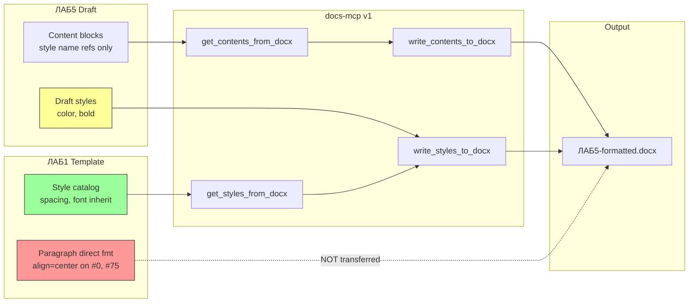

# Корректное применение стилей заголовков при reformat через docs-mcp

**Версия:** 1.0  
**Дата:** 2026-06-13  

---

## 1. Краткое описание

При применении workflow reformat (read contents → read styles → write contents → write styles) содержимое документа переносится корректно, а визуальное оформление заголовков **не соответствует шаблону**. Пользователь видит заголовки черновика: синий цвет, жирное начертание, выравнивание по левому краю — хотя в шаблоне ЛАБ1 титульный блок и «ВЫВОДЫ» центрированы, цвет чёрный (наследуется от Normal).

---

## 2. User Stories

### US-1: Применение стилей шаблона к заголовкам

**Как** студент, оформляющий лабораторную работу,  
**я хочу** перенести оформление из эталонного отчёта (ЛАБ1) в новый документ (ЛАБ5) одной командой через docs-mcp,  
**чтобы** заголовки выглядели идентично шаблону без ручной правки в Word.

**Критерии приёмки:**
- [ ] `Heading 1` и `Heading 2` в output визуально совпадают с шаблоном (шрифт, размер, цвет, начертание, отступы)
- [ ] Титульный блок и блок «ВЫВОДЫ» центрированы, как в ЛАБ1
- [ ] Синий цвет (`#365F91`, `#4F81BD`) из черновика не сохраняется после reformat

---

### US-2: Прозрачность переноса форматирования

**Как** агент (Cursor) или разработчик,  
**я хочу** понимать, какие свойства стиля переносятся, а какие — нет,  
**чтобы** не давать пользователю ложное ощущение «полного reformat» и корректно сообщать об ограничениях.

**Критерии приёмки:**
- [ ] SKILL.md / README явно перечисляют неподдерживаемые свойства (`color`, paragraph-level direct formatting)
- [ ] При union стилей документировано поведение `null` (сбрасывает / не сбрасывает)
- [ ] Tool response или лог содержит список полей, которые не были перенесены

---

### US-3: Сброс унаследованных свойств черновика

**Как** пользователь, применяющий корпоративный шаблон к документу с «чужими» стилями Word,  
**я хочу**, чтобы стили шаблона **полностью заменяли** одноимённые стили черновика,  
**чтобы** артефакты темы Word (синие заголовки, bold) не оставались после reformat.

**Критерии приёмки:**
- [ ] Если в шаблоне `bold: null` или не задан — в output bold сбрасывается (не наследуется из черновика)
- [ ] Если в шаблоне `color` не задан — в output цвет сбрасывается на наследование от base style / auto
- [ ] Union rule «template wins on conflict» распространяется на явный сброс (`null` / unset → удалить override)

---

### US-4: Перенос paragraph-level форматирования из шаблона (опционально, v2)

**Как** пользователь с шаблоном, где центровка задана на абзаце, а не в стиле,  
**я хочу** опционально копировать direct paragraph formatting для ключевых блоков из шаблона,  
**чтобы** reformat работал и для документов, где оформление не вынесено в style catalog.

**Критерии приёмки:**
- [ ] Режим «style mapping + paragraph overrides from template» документирован
- [ ] Для абзацев с одинаковым `style.name` можно применить alignment/spacing с соответствующего абзаца шаблона (heuristic или явная карта)

---

## 3. Issue: заголовки не меняются после reformat

### 3.1. Симптомы

| # | Ожидание (ЛАБ1) | Факт (output) | Статус |
|---|-----------------|---------------|--------|
| 1 | Times New Roman, 14 pt | Times New Roman, 14 pt | ✅ |
| 2 | Отступы Heading 1: before 18 pt, after 4 pt | before 18 pt, after 4 pt | ✅ |
| 3 | Heading 2: 16 pt | 16 pt | ✅ |
| 4 | Цвет заголовков: чёрный (auto / от Normal) | Синий `#365F91` (H1), `#4F81BD` (H2) | ❌ |
| 5 | Жирность: как в шаблоне (не bold в style def) | `bold: true` из черновика | ❌ |
| 6 | Титул и «ВЫВОДЫ»: `align=center` | `align=None` (left) | ❌ |

**Файлы:**
- Шаблон: `task5/ЛАБ1-Сапожников-ИИ-25-5-о.docx`
- Черновик: `task5/ЛАБ5-Сапожников-ИИ-25-5-о.docx`
- Output: `task5/ЛАБ5-Сапожников-ИИ-25-5-о-формат.docx`

**Workflow:** `get_contents_from_docx` (ЛАБ5) → `get_styles_from_docx` (ЛАБ1) → `write_contents_to_docx` → `write_styles_to_docx`

**Результат write_styles (факт):** `styles_added: 13`, `styles_updated: 35`, `styles_unchanged: 1`

---

### 3.2. Шаги воспроизведения

1. Иметь черновик ЛАБ5 со стилями Word theme (синие Heading 1/2, bold).
2. Иметь шаблон ЛАБ1 с Times New Roman, центрированным титулом.
3. Выполнить reformat workflow docs-mcp (4 tool calls с pagination).
4. Открыть output в Word/LibreOffice.
5. Сравнить заголовки с ЛАБ1.

**Ожидаемый результат:** заголовки как в ЛАБ1.  
**Фактический результат:** заголовки визуально как в черновике (цвет, bold, без центровки); изменились только шрифт и часть отступов.

---

### 3.3. Root Cause Analysis

#### RC-1: `color` не поддерживается в docs-mcp v1

`ParagraphStyleInfo` (`src/docx_mcp/domain/style_profile.py`) не содержит поля `color`.  
`StyleExtractor` не извлекает цвет из `style.font.color`.  
`StyleMigrator` не записывает цвет в styles part.

**Следствие:** цвет `#365F91` / `#4F81BD` из определения стилей черновика остаётся в output после union.

#### RC-2: Union не сбрасывает поля при `null` в шаблоне

Правило «incoming (template) wins on name conflict» применяется только к **явно заданным** полям.  
Если в шаблоне `bold: null`, `alignment: null`, значение из черновика (`bold: true`) **не перезаписывается**.

**Пример (Heading 1):**

```
ЛАБ5 draft style:  bold=true,  color=#365F91, alignment=null
ЛАБ1 template:     bold=null,  color=—,       alignment=null  (в style catalog)
Output:            bold=true,  color=#365F91, alignment=null
```

#### RC-3: Центровка в ЛАБ1 — paragraph-level, не style-level

В ЛАБ1 только 2 абзаца с `Heading 1` имеют `paragraph_format.alignment = CENTER`:

```
#0  [Heading 1]  align=CENTER  «ЛАБОРАТОРНАЯ РАБОТА №1…»
#75 [Heading 1]  align=CENTER  «ВЫВОДЫ ПО РАБОТЕ»
```

`get_styles_from_docx` для `Heading 1` возвращает `alignment: null`.

Content blocks (`get_contents_from_docx`) хранят только **ссылку на имя стиля**, без paragraph-level alignment:

```json
{
  "block_type": "paragraph",
  "style": { "name": "Heading 1", "style_type": "paragraph" },
  "runs": [{ "text": "ЛАБОРАТОРНАЯ РАБОТА №5", "bold": null }]
}
```

**Следствие:** центровка из шаблона никогда не попадает в output.

#### RC-4: Ограничение v1 задокументировано частично

SKILL.md (`Limitations v1`):

> Do not expect support for: headers/footers content, floating images, text boxes, footnotes, numbering restart, or **run-level formatting override when a named style is applied**.

Не упомянуты: **font color**, **paragraph-level direct formatting**, **semantics union null**.

---

### 3.4. Диагностические данные

#### Извлечение docs-mcp из ЛАБ1 (style catalog)

```json
{
  "name": "Heading 1",
  "base_style": "Normal",
  "font_name": null,
  "font_size_pt": null,
  "bold": null,
  "alignment": null,
  "space_before_pt": 18.0,
  "space_after_pt": 4.0
}
```

#### Определение стиля в output (python-docx)

```
Heading 1: font=Times New Roman 14pt, bold=True, color=365F91, alignment=None
Heading 2: font=Times New Roman 16pt, bold=True, color=4F81BD, alignment=None
```

#### Использование стилей в ЛАБ5 (15 заголовков)

| Стиль | Кол-во | Примеры |
|-------|--------|---------|
| Heading 1 | 8 | «ЛАБОРАТОРНАЯ РАБОТА №5», «1. Цель работы», «ВЫВОДЫ ПО РАБОТЕ» |
| Heading 2 | 7 | подзаголовок темы, «Файл vendor/delivery.h» |

---

## 4. Scope решения

### 4.1. In scope (минимальный fix)

| ID | Задача | Приоритет |
|----|--------|-----------|
| F-1 | Добавить `font_color` в `ParagraphStyleInfo`, extractor, migrator | P0 |
| F-2 | Union: `null` в incoming = явный сброс override в target style | P0 |
| F-3 | Обновить SKILL.md / README: color, null-semantics, paragraph alignment | P1 |
| F-4 | Тест: reformat plain.docx + format.docx — heading color/bold/alignment | P0 |

### 4.2. Out of scope (v1.x / v2)

- Копирование paragraph-level direct formatting из шаблона (US-4)
- Run-level color/bold override
- Headers/footers, images, numbering

### 4.3. Workaround (без изменения docs-mcp)

Post-processing через python-docx для конкретного output:

1. `Heading 1` / `Heading 2`: сбросить `font.color`, `font.bold`
2. Абзацы `#0`, `#97` (титул, выводы): `paragraph_format.alignment = CENTER`

---

## 5. Acceptance Criteria (Definition of Done)

Reformat ЛАБ5 → output считается успешным, если:

1. **Color:** `Heading 1`, `Heading 2` — `font.color` is None / auto (не `#365F91`, `#4F81BD`)
2. **Bold:** `Heading 1`, `Heading 2` — `font.bold` is None / False (как resolved из ЛАБ1)
3. **Alignment:** абзацы «ЛАБОРАТОРНАЯ РАБОТА №5» и «ВЫВОДЫ ПО РАБОТЕ» — `alignment = center` *(требует F-5 или workaround)*
4. **Regression:** существующие тесты `test_reformat_pipeline.py` проходят
5. **Docs:** SKILL.md описывает поддержку `font_color` и поведение null-reset

---

## 6. Связанные артеfactы

| Артеfact | Путь |
|----------|------|
| Skill workflow | `.agents/skills/docx-mcp/SKILL.md` |
| Style domain | `docs-mcp/src/docx_mcp/domain/style_profile.py` |
| Style extractor | `docs-mcp/src/docx_mcp/adapters/style_extractor.py` |
| Style migrator | `docs-mcp/src/docx_mcp/adapters/style_migrator.py` |
| Reformat test | `docs-mcp/tests/test_reformat_pipeline.py` |
| Тестовые фикстуры | `docs-mcp/tests/assets/plain.docx`, `format.docx` |

---

## 7. Риски и открытые вопросы

| # | Вопрос | Варианты |
|---|--------|----------|
| Q-1 | Как трактовать `null` vs «не задано» vs «inherit»? | (a) null = reset; (b) null = keep existing; (c) tri-state enum |
| Q-2 | Центровка только титула или всех Heading 1? | В ЛАБ1 center только на титуле и выводах; секции «1. Цель» — left |
| Q-3 | Нужен ли отдельный tool `reformat_docx` с heuristic mapping? | Монолит vs orchestration (текущий подход) |
| Q-4 | Структура ЛАБ5 (H1 + H2 для титула) vs ЛАБ1 (один H1) — выравнивать структуру? | Контентная правка вне scope docs-mcp |

---

## 8. Приложение: схема потока данных



**Легенда:** зелёный — переносится; красный — не переносится; жёлтый — частично остаётся из черновика.
